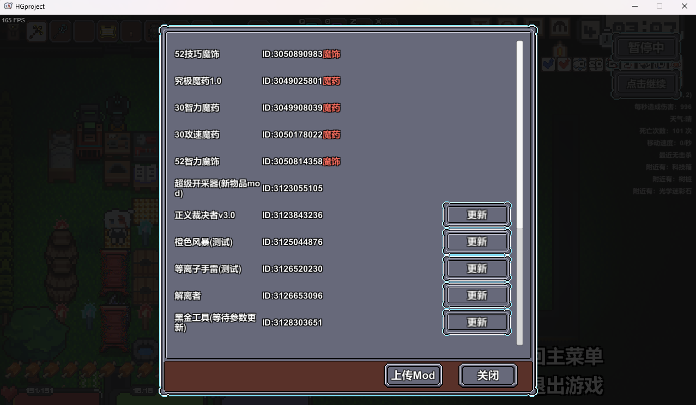
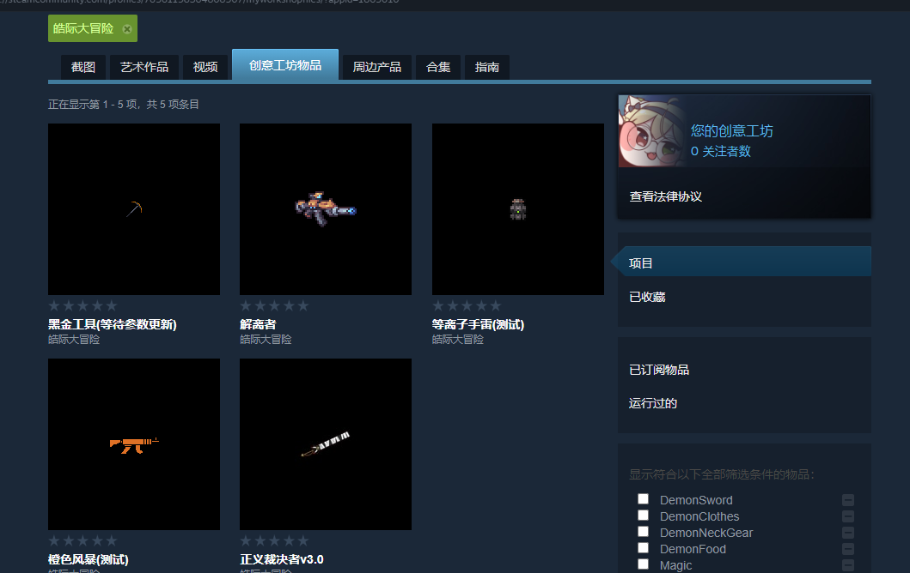

# 快速入门

### 安装软件

对于编写皓际大冒险的mod，我个人推荐使用Visual Stuido Code(简称VSCode)，当然使用文本簿之类的文本编辑器也是可以的。

[下载VSCode](https://code.visualstudio.com/Download)

点开下载链接后，选择适合自己的软件包下载并安装。如果不会下载安装的，推荐还是先学习一下计算机相关基础知识再来写MOD吧。

### 认识MOD

首先，我们来认识一下皓际大冒险的MOD是什么形式的。

和常规形式的需要编程的MOD不同，皓际大冒险的MOD是以JSON的形式储存的。JSON 指的是 JavaScript 对象表示法（**J**ava**S**cript **O**bject **N**otation），具有较为严格的格式。关于JSON的语法可以自行查看[JSON 语法 | 菜鸟教程 (runoob.com)](https://www.runoob.com/json/json-syntax.html)，在这里就不过多解释了。在皓际大冒险的MOD里，中文使用的是Unicode编码，关于Unicode是什么可以自行查看[Unicode、UTF-8、UTF-16 终于懂了 - 知乎 (zhihu.com)](https://zhuanlan.zhihu.com/p/427488961)。

说完了MOD的形式，接下来我们来说说MOD的结构：

MOD包含三个文件夹和一个txt文件<br>
CM：物品配方<br>
&nbsp;└<code>物品配方</code><br>
WSITEM：物品定义<br>
&nbsp;├<code>物品定义</code><br>
&nbsp;└<code>物品贴图</code><br>
WSAMMO：自定义弹幕<br>
&nbsp;└<code>弹幕信息</code><br>
HGWSDATA.txt：物品实现<br>

**物品配方**：物品的合成材料和数量是什么，合成物和合成物数量是什么，在什么工作站合成。

**物品定义**：物品的各种属性是什么，比如攻击力，物品ID，品质。

**自定义弹幕**：物品攻击的弹幕的属性，比如弹幕ID，弹幕的飞行速度，弹幕的触发方式。

### 第一个MOD

说完了这些，你可能还是很懵，下面让我们来动手做一个MOD吧。

首先我们来创建一个文件夹，用来放我们的MOD文件，文件夹的名字起什么都行，随便你。

打开VSCode，把这个文件夹拖进去打开，并且信任这个文件夹。在里面新建两个文件夹，一个叫**CM**，另一个叫**WSITEM**，最后新建一个叫**HGWSDATA**的txt文件。

打开**CM**文件夹，新建一个叫**外来物**的文件，并且往里面复制以下代码：

```json
{
"ID":0,
"mat1":27,
"mat1Num":1,
"mat2":0,
"mat2Num":0,
"mat3":0,
"mat3Num":0,
"result":17777,
"resultNum":1,
"place":4
}
```

然后，我们打开**WSITEM**文件夹，同样也新建一个叫**外来物**的文件，并且往里面复制以下代码：

```json
{
"ID":17777,
"GOBJID":2822,
"nameCn":"\u5916\u6765\u7269",
"nameEn":"NoobItem",
"description":"\u8fd9\u662f\u7693\u9645\u5927\u5192\u9669mod\u5236\u4f5c\u7684\u5916\u6765\u7269",
"iconPath":"\u5916\u6765\u7269.png",
"itemType":3,
"atk":100000000,
"quality":7,
"maxNum":1,
"price":1000,
"STRRate":11,
"TECRate":11,
"INTRate":11,
"AmmoID":289,
"atkSpeed":2000,
"weaponType":2
}
```

同时，我们往里面放一张叫做**外来物**的图片，格式为.png，放什么图片都行(也可以直接拿下面这张图)。


最后，我们打开外面的**HGWSDATA.txt**，并且往里面复制以下代码：

```json
{
"Items":["\u5916\u6765\u7269"],
"CM":["\u5916\u6765\u7269"]
}
```

然后我们打开游戏，进入游戏后，在游戏的暂停页面，

点击**创意工坊**，


再点击**上传Mod**



然后输入物品名称(steam创意工坊上面显示的)，缩略图路径选择自己喜欢的图片(不一定是物品图片)，物品路径选择我们的整个文件夹(包含**CM**，**WSITEM**和**HGWSDATA.txt**的文件夹)，然后点击上传。


点击上传后，会提示上传物品成功。


这时候打开steam创意工坊，点击**您发布的文件**


这时候我们应该能看到我们上传的物品了



这时候我们订阅我们上传的物品，然后重启游戏，拿一个石头放在背包里，应该可以在铁砧看到我们自己上传的物品了。(如图是我自己上传的物品)


如果到这里，你已经成功可以在游戏里面获取你自己写的物品了，那么恭喜你，已经初步掌握了制作Mod的大概流程。
